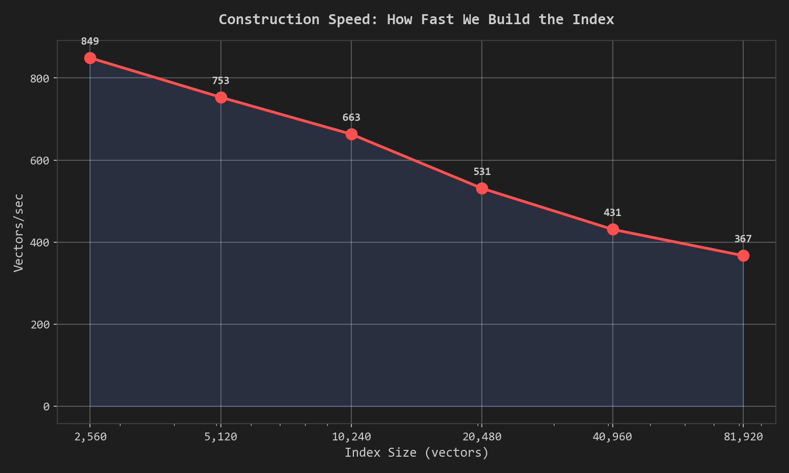
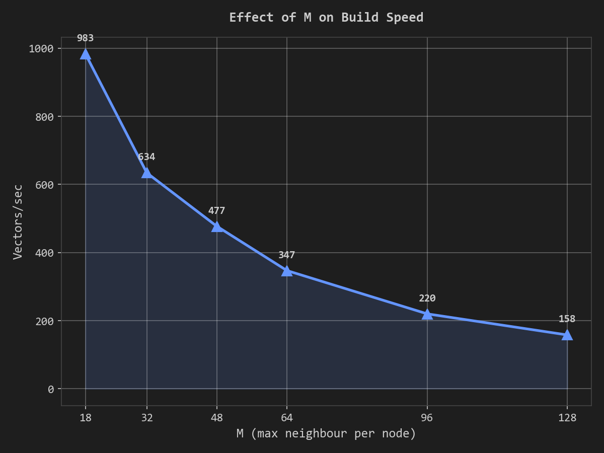
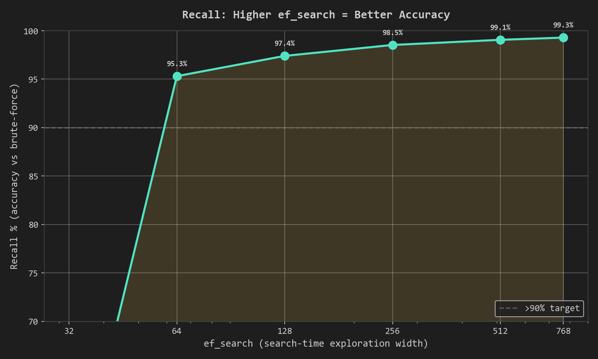
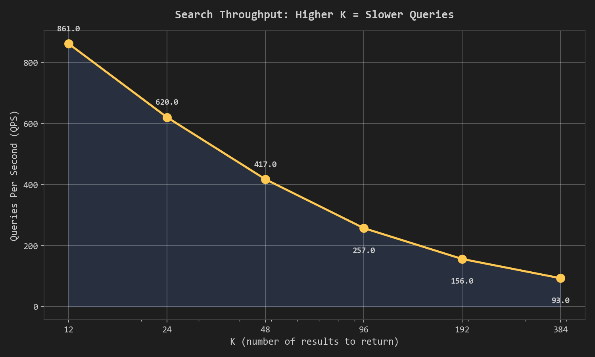
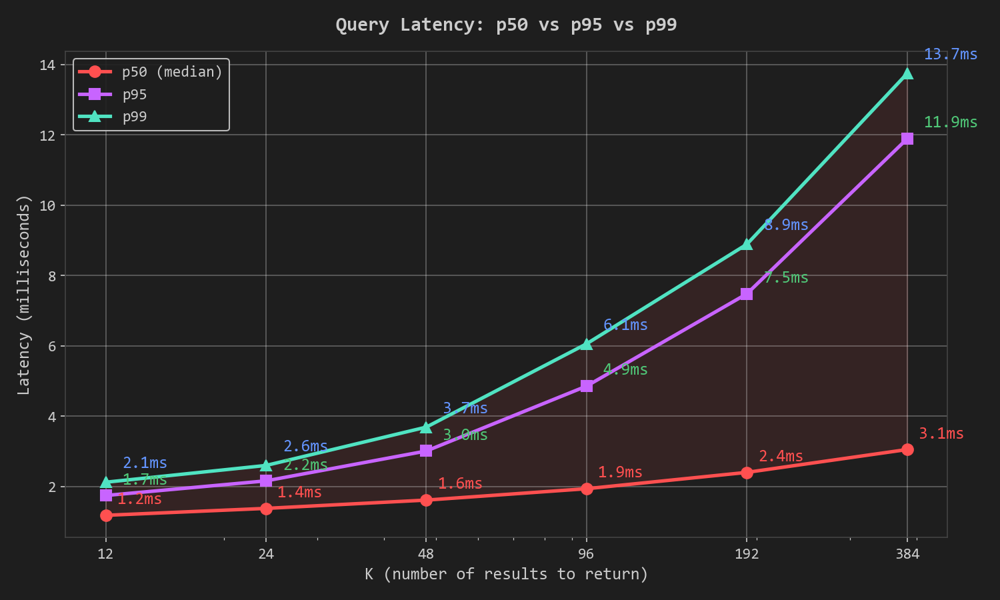

# Blaze-DB


Blaze-DB is a high-performance vector database written in Rust, designed for efficient storage and fast retrieval of
embeddings using HNSW Indexing.

## Current State

- Two binaries: `blaze-server` and `blaze-client`, for server and client wrapper operations respectively.
- Batch/Chunks processing for embedding generation (Only used in CLI Wrapper).
- Stores/Index embeddings on disk in binary/JSON format.
- Use memory-mapped files for fast loading and concurrent reads, rayon for parallel processing (where possible).
- Index caching (LRU), which gives about 86x faster I/O with reads and writes lockings (thread-safe).
- Implements HNSW (Hierarchical Navigable Small World) graph for approximate nearest neighbor search.
- Uses semantic similarity search with multiple distance metrics (Cosine, Euclidean, Dot Product).
- Performance benchmarking suite (<1ms per search on War and Peace dataset, <5ms per search on Amazon Product Dataset).
- Safe Index cache-locks for concurrent access, with cache validation and eviction policies.
- Crash safe write operations with temporary files and atomic renaming. (COW style 🐄)
- Backup and restore functionality for databases and sources. (Few caveats, need improvement, but ready for happy path)
- Bench ARG `blzdb bench` to CLI for quick benchmarking on Concurrent Write/Reads workload with Isolated environment.
- Lazy deletion with tombstone nodes and background reindexing job for low disk space usage. (Needs improvement, but
  works for now)
- DashMap for superfast in-memory concurrent metadata storage, very good for cache invalidation and quick lookups. (No
  more global locks for metadata! or disk hitting during non-write operations.)
- Configurable server settings with environment variables and .env file support. (Docker friendly)

## Quick Links

- [Docker Hub Image](https://hub.docker.com/r/ronakgh97/blazedb) - `docker pull ronakgh97/blazedb:latest`
- [Pre-indexed Dataset (Google Drive)](https://drive.google.com/file/d/1rnnpMNYzbwkOr9dIetZW83JeF5WCV5cL/view?usp=sharing) -
  350K vectors, ready to use
- [Amazon Products Source Dataset](https://www.kaggle.com/datasets/asaniczka/amazon-products-dataset-2023-1-4m-products) -
  About 1.4M 2023 products, for indexing and testing
- [BlazeDB Service](https://github.com/ronakgh97/blazedb-service) - A Saas layer on top of Blaze-DB for easy hosting and
  management (In development) 🫡 `I dont like Saas honestly`

## Usage

### Build from Source (Cargo needed)

```shell
# Initialize dotfiles
blzdb init

blzdb serve
[20:59:16][INFO] Starting the Server...
[20:59:16][INFO] "Provider (Model: text-embedding-qwen3-embedding-0.6b, Url: http://host...., Key: loca...)"
[20:59:16][INFO] Source: default_src is valid
[20:59:16][INFO] Starting server with 1 valid source(s)
[20:59:16][INFO] Server is running on http://0.0.0.0:8080
[20:59:16][INFO] Using 1 Sources
[20:59:16][INFO] Backup scheduler enabled: false
[20:59:16][INFO] Index cache capacity: 128
[20:59:16][INFO] CORS: all origins allowed
[20:59:16][INFO] Process ID: 34716
[20:59:16][INFO] Server started
```

- Download the Index
  here: [Google Drive Link](https://drive.google.com/file/d/13tSMijMC3C7xV1lbV_EiWk46hfNKNuf7/view?usp=sharing)
- Checksum (Sha256): **2621bb7a65f3da9f38d50ebda2fd619b49332a6ade02e51f5d4c1c7b118e2763**
- Extract to `~/.blaze/sources/default_src/amazon_products_2023/`

### Docker

```shell
docker pull ronakgh97/blazedb:latest

# Run the container (use --backup flag to start with backup scheduler enabled)
docker run -d \
  --name blazedb \
  -p 8080:8080 \
  --env-file .env \
  -v blazedb-config:/home/blazedb/.config/blaze \
  -v blazedb-sources:/home/blazedb/blaze \F
  -v blazedb-backups:/home/blazedb/backups \
  ronakgh97/blazedb:latest
```

- Download Pre-Indexed
  from: [Google Drive Link](https://drive.google.com/file/d/13tSMijMC3C7xV1lbV_EiWk46hfNKNuf7/view?usp=sharing)
- Checksum (SHA256): **2621bb7a65f3da9f38d50ebda2fd619b49332a6ade02e51f5d4c1c7b118e2763**
- Extract and copy to Docker volume
- Before copying, create a database `amazon_products_2023` using CLI or API, so that the server recognizes it.

```shell
docker cp amazon_products_2023 blazedb-server:/home/blazedb/blaze/sources/default_src/amazon_products_2023
```

### Query using CLI Client

```shell
blzdb create --database amazon_products_2023 --source default_src

blzdb query --database amazon_products_2023 --source default_src --search "Wireless Bluetooth Headphones with Noise Cancellation" --top_k 10
```

## Benchmarks

### Run Isolated Benchmark

```shell
blzdb bench
BENCHMARK RESULTS

Concurrent Writes
   Databases: 108 | Vectors/DB: 1106
   Total Time: 15.56s
   Min: 4.037s | Max: 15.516s | Avg: 10.751s
   Success: 108/108 ✓
   Speedup: 74.6x (vs sequential)
   Server CPU: 80.3% (avg) / 91.4% (peak)
   Server Memory: 549.6 MB (avg) / 856 MB (peak)

Thundering herd
   Concurrent Requests: 796
   Total Time: 1.59s
   Min: 0.021s | Max: 1.561s | Avg: 0.718s
   Success: 796/796 ✓
   Latency Ratio: 78.0x ✗ (high)
   Latency Percentiles: P50: 682.9ms | P95: 1190.8ms | P99: 1557.8ms
   Server Search: P50: 3.9ms | P95: 13.3ms | P99: 61.1ms   (HNSW search time)
   Server I/O: P50: 0.0ms | P95: 0.0ms | P99: 0.1ms   (disk/metadata I/O time)
   Memory: 74.3 MB (avg) / 107 MB (peak) ✗ (unstable)

Mixed Read/Write Workload
   Readers: 73 (56 queries each)
   Writers: 23 (8 inserts of 527 vectors each)
   Total Time: 32.08s
   Successful Reads: 4088/4088 ✓
   Successful Writes: 184/184 ✓
   Server CPU: 79.0% (avg) / 89.4% (peak)
   Server Memory: 866.6 MB (avg) / 1057 MB (peak)
 Some benchmarks had issues, don't question my code and get a better CPU
```

- This commands spin ups child background blz servers in temp environment
- Bench simulates client-server interactions with concurrent reads and writes, measuring latency, throughput, and
  resource usage.

### SEARCH ON 2023 AMAZON PRODUCT DATASET (400k Index)

```shell
Query: Gaming RTX 4060 Laptop with 165Hz Display
Search completed in: 3.414ms
Top 100 search results for query: 'Gaming RTX 4060 Laptop with 165Hz Display'
1. ID: 38801a5b-f49d-4ef2-ad7a-6ada98884d0e, Score: 0.83
Title: ASUS Dual GeForce RTX™ 4060 OC Edition 8GB GDDR6 (PCIe 4.0, 8GB GDDR6, DLSS 3, HDMI 2.1a, DisplayPort 1.4a, 2.5-Slot Design, Axial-tech Fan Design, 0dB Technology, and More)
2. ID: 0c696905-6bb1-4275-9a39-9eb7b4588d89, Score: 0.82
Title: ASUS Dual GeForce RTX™ 4060 Ti OC Edition 8GB GDDR6 (PCIe 4.0, 8GB GDDR6, DLSS 3, HDMI 2.1, DisplayPort 1.4a, Axial-tech Fan Design, 0dB Technology, and More)
3. ID: 3f066ff0-bf50-4c40-bb93-14b6d4106393, Score: 0.82
Title: Acer Predator Helios 16 Gaming Laptop | 13th Gen Intel Core i7-13700HX | NVIDIA GeForce RTX 4060 | 16" 2560 x 1600 165Hz G-SYNC Display | 16GB DDR5 | 1TB Gen 4 SSD | Killer Wi-Fi 6E | PH16-71-74UU                                                 
4. ID: 629fde5c-dbb3-4940-bcb3-602acbcab298, Score: 0.82
Title: ASUS Dual GeForce RTX™ 4060 Ti 16GB OC Edition GDDR6 (PCIe 4.0, 16GB GDDR6, DLSS 3, HDMI 2.1a, DisplayPort 1.4a, 2.5-Slot Design, Axial-tech Fan Design, 0dB Technology, and More)                                                                   
5. ID: 1b160aa9-bc3d-4057-84f1-ba40793830b4, Score: 0.81
Title: ASUS Dual GeForce® RTX 4070 OC Edition 12GB GDDR6X, IP5X, Auto-Extreme Technology, 144-Hour Validation Program, HDMI 2.1a, DP 1.4a                                                                                                                   
6. ID: e35a4f2b-96a7-4917-a067-81a7c70d7a4a, Score: 0.81
Title: Razer Blade 14 Gaming Laptop (2023): AMD Ryzen 9 7940HS CPU - NVIDIA GeForce RTX 4070 GPU - 14" 16:10 QHD+ 240Hz -16GB DDR5 RAM - 1TB SSD - Windows 11 - Vapor Chamber Cooling - Chroma RGB                                                          
7. ID: 083c34b6-fc42-477d-a102-4ae809f612c1, Score: 0.81
Title: Razer Blade 16 Gaming Laptop: NVIDIA GeForce RTX 4090-13th Gen Intel 24-Core i9 HX CPU - 16" Dual Mode Mini LED (4K UHD+ 120Hz & FHD+ 240Hz) - 32GB RAM - 2TB SSD - Compact GaN Charger - Windows 11                                                 
8. ID: 37a48f7e-2dfd-4e3d-8f90-78875c02cf1a, Score: 0.81
Title: Acer Nitro 17 Gaming Laptop | AMD Ryzen 7 7735HS Octa-Core CPU | NVIDIA GeForce RTX 4050 GPU | 17.3" FHD 165Hz IPS Display | 16GB DDR5 | 1TB Gen 4 SSD | Wi-Fi 6E | RGB Backlit KB | AN17-41-R8N5, Black                                             
9. ID: 20a3f68f-38f9-40cc-a4d4-0a998fe35519, Score: 0.80
Title: Lenovo IdeaPad Gaming 3 - (2022) - Essential Gaming Laptop Computer - 15.6" FHD - 120Hz - AMD Ryzen 5 6600H - NVIDIA GeForce RTX 3050 - 8GB DDR5 RAM - 256GB NVMe Storage - Windows 11 Home                                                          
10. ID: 15d7b55a-90da-40ce-9844-879f8bbe6fac, Score: 0.80
Title: Razer Blade 18 Gaming Laptop: NVIDIA GeForce RTX 4090-13th Gen Intel 24-Core i9 HX CPU - 18" QHD+ 240Hz - 32GB RAM - 2TB SSD - CNC Aluminum - Compact GaN Charger - Windows 11 - Chroma RGB                                                          

Brute search results (for comparison)
Brute search completed in: 73.8505ms
1. ID: 38801a5b-f49d-4ef2-ad7a-6ada98884d0e, Score: 0.83
Title: ASUS Dual GeForce RTX™ 4060 OC Edition 8GB GDDR6 (PCIe 4.0, 8GB GDDR6, DLSS 3, HDMI 2.1a, DisplayPort 1.4a, 2.5-Slot Design, Axial-tech Fan Design, 0dB Technology, and More)                                                                        
2. ID: 0c696905-6bb1-4275-9a39-9eb7b4588d89, Score: 0.82
Title: ASUS Dual GeForce RTX™ 4060 Ti OC Edition 8GB GDDR6 (PCIe 4.0, 8GB GDDR6, DLSS 3, HDMI 2.1, DisplayPort 1.4a, Axial-tech Fan Design, 0dB Technology, and More)                                                                                       
3. ID: 3f066ff0-bf50-4c40-bb93-14b6d4106393, Score: 0.82
Title: Acer Predator Helios 16 Gaming Laptop | 13th Gen Intel Core i7-13700HX | NVIDIA GeForce RTX 4060 | 16" 2560 x 1600 165Hz G-SYNC Display | 16GB DDR5 | 1TB Gen 4 SSD | Killer Wi-Fi 6E | PH16-71-74UU                                                 
4. ID: 629fde5c-dbb3-4940-bcb3-602acbcab298, Score: 0.82
Title: ASUS Dual GeForce RTX™ 4060 Ti 16GB OC Edition GDDR6 (PCIe 4.0, 16GB GDDR6, DLSS 3, HDMI 2.1a, DisplayPort 1.4a, 2.5-Slot Design, Axial-tech Fan Design, 0dB Technology, and More)                                                                   
5. ID: 1b160aa9-bc3d-4057-84f1-ba40793830b4, Score: 0.81
Title: ASUS Dual GeForce® RTX 4070 OC Edition 12GB GDDR6X, IP5X, Auto-Extreme Technology, 144-Hour Validation Program, HDMI 2.1a, DP 1.4a                                                                                                                   
6. ID: e35a4f2b-96a7-4917-a067-81a7c70d7a4a, Score: 0.81
Title: Razer Blade 14 Gaming Laptop (2023): AMD Ryzen 9 7940HS CPU - NVIDIA GeForce RTX 4070 GPU - 14" 16:10 QHD+ 240Hz -16GB DDR5 RAM - 1TB SSD - Windows 11 - Vapor Chamber Cooling - Chroma RGB                                                          
7. ID: 083c34b6-fc42-477d-a102-4ae809f612c1, Score: 0.81
Title: Razer Blade 16 Gaming Laptop: NVIDIA GeForce RTX 4090-13th Gen Intel 24-Core i9 HX CPU - 16" Dual Mode Mini LED (4K UHD+ 120Hz & FHD+ 240Hz) - 32GB RAM - 2TB SSD - Compact GaN Charger - Windows 11                                                 
8. ID: 37a48f7e-2dfd-4e3d-8f90-78875c02cf1a, Score: 0.81
Title: Acer Nitro 17 Gaming Laptop | AMD Ryzen 7 7735HS Octa-Core CPU | NVIDIA GeForce RTX 4050 GPU | 17.3" FHD 165Hz IPS Display | 16GB DDR5 | 1TB Gen 4 SSD | Wi-Fi 6E | RGB Backlit KB | AN17-41-R8N5, Black                                             
9. ID: 20a3f68f-38f9-40cc-a4d4-0a998fe35519, Score: 0.80
Title: Lenovo IdeaPad Gaming 3 - (2022) - Essential Gaming Laptop Computer - 15.6" FHD - 120Hz - AMD Ryzen 5 6600H - NVIDIA GeForce RTX 3050 - 8GB DDR5 RAM - 256GB NVMe Storage - Windows 11 Home                                                          
10. ID: 15d7b55a-90da-40ce-9844-879f8bbe6fac, Score: 0.80
Title: Razer Blade 18 Gaming Laptop: NVIDIA GeForce RTX 4090-13th Gen Intel 24-Core i9 HX CPU - 18" QHD+ 240Hz - 32GB RAM - 2TB SSD - CNC Aluminum - Compact GaN Charger - Windows 11 - Chroma RGB                                                          

Speedup: 21.63x
```

- <5ms with ~21x is pretty good for 400_000 vectors! I guess...
- Amazon product 2023
  dataset: [Source Link](https://www.kaggle.com/datasets/asaniczka/amazon-products-dataset-2023-1-4m-products?select=amazon_products.csv)

### SEARCH ON WAR AND PEACE DATASET

```shell
blzcli query --search "War and peace" --database def_db --source default_src --top-k 10 

Search querying the database: def_db


Item 1:
Metadata: thousand corpses lay there, but even on the island of St. Helena in the peaceful solitude where he said he intended to devote his leisure to an account of the great deeds he had done, he wrote: The Russian war should have been the most popular war of modern times: it was a war of good sense, for real interests, for the tranquillity and security of all; it was purely pacific and conservative. It was a war for a great cause, the end of uncertainties and the beginning of security. A new horizon and new labors were opening out, full of well-being and prosperity for all. The European system was already founded; all that remained was to organize it. Satisfied on these great points and with tranquility everywhere, I too should have had my Congress and my Holy Alliance. Those ideas were                 
Score: 0.56

Item 2:
Metadata: Author: graf Leo Tolstoy Translator: Aylmer Maude Louise Maude Release date: April 1, 2001 [eBook #2600] Most recently updated: June 14, 2022 Language: English Credits: An Anonymous Volunteer and David Widger *** START OF THE PROJECT GUTENBERG EBOOK WAR AND PEACE *** WAR AND PEACE By Leo Tolstoy/Tolstoi CHAPTER I “Well, Prince, so Genoa and Lucca are now just family estates of the Buonapartes. But I warn you, if you don’t tell me that this means war, if you still try to defend the infamies and horrors perpetrated by that Antichrist—I really believe he is Antichrist—I will have nothing more to do with you and you are no longer my friend, no longer my ‘faithful slave,’ as you call yourself! But how do you do? I see I have frightened you—sit down and tell me all the news.”                          
Score: 0.55

Item 3:
Metadata: when there was a war, like this one, it would be war! And then the determination of the troops would be quite different. Then all these Westphalians and Hessians whom Napoleon is leading would not follow him into Russia, and we should not go to fight in Austria and Prussia without knowing why. War is not courtesy but the most horrible thing in life; and we ought to understand that and not play at war. We ought to accept this terrible necessity sternly and seriously. It all lies in that: get rid of falsehood and let war be war and not a game. As it is now, war is the favorite pastime of the idle and frivolous. The military calling is the most highly honored. “But what is war? What is needed for success in warfare? What are the                                                                       
Score: 0.54

Item 4:
Metadata: that: get rid of falsehood and let war be war and not a game. As it is now, war is the favorite pastime of the idle and frivolous. The military calling is the most highly honored. “But what is war? What is needed for success in warfare? What are the habits of the military? The aim of war is murder; the methods of war are spying, treachery, and their encouragement, the ruin of a country’s inhabitants, robbing them or stealing to provision the army, and fraud and falsehood termed military craft. The habits of the military class are the absence of freedom, that is, discipline, idleness, ignorance, cruelty, debauchery, and drunkenness. And in spite of all this it is the highest class, respected by everyone. All the kings, except the Chinese, wear military uniforms, and he who kills most people receives the highest rewards.                                                                                                                
Score: 0.53

Item 5:
Metadata: of states and nations in their conflicts with one another is expressed in wars, and that as a direct result of greater or less success in war the political strength of states and nations increases or decreases. Strange as may be the historical account of how some king or emperor, having quarreled with another, collects an army, fights his enemy’s army, gains a victory by killing three, five, or ten thousand men, and subjugates a kingdom and an entire nation of several millions, all the facts of history (as far as we know it) confirm the truth of the statement that the greater or lesser success of one army against another is the cause, or at least an essential indication, of an increase or decrease in the strength of the nation—even though it is unintelligible why the defeat of an army—a hundredth part of a nation—should oblige                                                                                                        
Score: 0.52

Item 6:
Metadata: fatherland, and it happened in the greatest of all known wars. The period of the campaign of 1812 from the battle of Borodinó to the expulsion of the French proved that the winning of a battle does not produce a conquest and is not even an invariable indication of conquest; it proved that the force which decides the fate of peoples lies not in the conquerors, nor even in armies and battles, but in something else. The French historians, describing the condition of the French army before it left Moscow, affirm that all was in order in the Grand Army, except the cavalry, the artillery, and the transport—there was no forage for the horses or the cattle. That was a misfortune no one could remedy, for the peasants of the district burned their hay rather than let the French have it.                    
Score: 0.51

Item 7:
Metadata: did in 1813—salute according to all the rules of art, and, presenting the hilt of their rapier gracefully and politely, hand it to their magnanimous conqueror, but at the moment of trial, without asking what rules others have adopted in similar cases, simply and easily pick up the first cudgel that comes to hand and strike with it till the feeling of resentment and revenge in their soul yields to a feeling of contempt and compassion. CHAPTER II One of the most obvious and advantageous departures from the so-called laws of war is the action of scattered groups against men pressed together in a mass. Such action always occurs in wars that take on a national character. In such actions, instead of two crowds opposing each other, the men disperse, attack singly, run away when attacked by stronger forces, but again attack when opportunity offers. This was done                                                                            
Score: 0.51

Item 8:
Metadata: of the statement that the greater or lesser success of one army against another is the cause, or at least an essential indication, of an increase or decrease in the strength of the nation—even though it is unintelligible why the defeat of an army—a hundredth part of a nation—should oblige that whole nation to submit. An army gains a victory, and at once the rights of the conquering nation have increased to the detriment of the defeated. An army has suffered defeat, and at once a people loses its rights in proportion to the severity of the reverse, and if its army suffers a complete defeat the nation is quite subjugated. So according to history it has been found from the most ancient times, and so it is to our own day. All Napoleon’s wars serve to confirm this                                     
Score: 0.50

Item 9:
Metadata: had thought it was all the same to him whether or not Moscow was taken as Smolénsk had been, was suddenly checked in his speech by an unexpected cramp in his throat. He paced up and down a few times in silence, but his eyes glittered feverishly and his lips quivered as he began speaking. “If there was none of this magnanimity in war, we should go to war only when it was worth while going to certain death, as now. Then there would not be war because Paul Ivánovich had offended Michael Ivánovich. And when there was a war, like this one, it would be war! And then the determination of the troops would be quite different. Then all these Westphalians and Hessians whom Napoleon is leading would not follow him into Russia, and we should not go to fight in Austria and Prussia                             
Score: 0.50

Item 10:
Metadata: don’t understand what is meant by ‘a skillful commander,’” replied Prince Andrew ironically. “A skillful commander?” replied Pierre. “Why, one who foresees all contingencies... and foresees the adversary’s intentions.” “But that’s impossible,” said Prince Andrew as if it were a matter settled long ago. Pierre looked at him in surprise. “And yet they say that war is like a game of chess?” he remarked. “Yes,” replied Prince Andrew, “but with this little difference, that in chess you may think over each move as long as you please and are not limited for time, and with this difference too, that a knight is always stronger than a pawn, and two pawns are always stronger than one, while in war a battalion is sometimes stronger than a division and sometimes weaker than a company. The relative strength of bodies of troops can                                                                                                                  
Score: 0.50
Time taken (sec): 0.0009919
```

### Cache Benchmarking

```shell
cargo nextest run test_cache_and_bench --release --run-ignored only --no-capture

running 1 test
Total time without cache: 3.3927011s (Client: 2.0225559s, Server: 1.3701452s)
Total time with cache: 0.041175100000000006s (Client: 0.0395715s, Server: 0.0016036000000000002s)
Improvement factor (Server side): 854.42x
test test_cache_and_bench ... ok

test result: ok. 1 passed; 0 failed; 0 ignored; 0 measured; 0 filtered out; finished in 4.08s
```

- There is no I/O overhead during cache validation (since it read from in-memory checksum map), now less disk hitting
  during non-write operations
  reduced. Checkout this file: [Cache Impl](./src/server/service/queries.rs)

### Concurrent Benchmarking

```shell
cargo nextest run stress_test_concurrent_writes_different_databases --release --run-ignored only --no-capture

running 1 test
Source created, creating 50 databases...
Databases created, starting concurrent writes...

 CONCURRENT WRITES TEST RESULTS:
  Databases written: 50
  Vectors per database: 2000
  Successful: 50/50
  Total time: 45.0082293s
  Min write time: 19.152629s
  Max write time: 40.6575577s
  Avg write time: 27.468832606s
  Expected if sequential: 1373.4416303s
  Speedup: 30.52x
Concurrent writes to different databases work in parallel!
test stress_test_concurrent_writes_different_databases ... ok
```

- Concurrent writes to different databases work in parallel🔥
- Each write operation is still quite slow due to HNSW indexing and slight disk read checks, but at least they don't
  block each other.
- Checkout the Test: [Stress Test](tests/stress_tests.rs)

### **Trust Me Bro** Benchmarks







- All Benchmarks are done with 16GB RAM and Intel i7 14th CPU, checkout `benches/` directory.
- [Datasets used](https://huggingface.co/datasets/KShivendu/dbpedia-entities-openai-1M/tree/main/data) (~1M vectors and
  1536 dim)

### TODO:

- HNSW (Hierarchical Navigable Small World) indexing for improved search performance. `DONE (basic implementation)`
- Fix Chunking for better meaningful text segments (Client-side btw). `DONE, but kinda broken for now.`
- Write/insert functionality for adding new vectors to the database.
  `DONE, few checks lefts`
- Find a way to manage multiple sources during server startup and runtime, load index into memory during it.
  `PARTIALLY DONE (Done using LRU, but there is no startup loading)`
- Fixed and complete error response in API.`IN PROGRESS`
- Use a basic In-memory (Hashmap) storage engine for thread-safe read and write operations for configs and server_files.
  `PARTIALLY DONE`.
- Too many clones across the codebase, memory explosion everywhere. `FIXED`
- Too many code duplications across modules. `NEED HELP`
- Similarity calculation caching for faster search queries. `IN PROGRESS`
- Implement LRU for fast cache query. `DONE`
- Make a storage engine, e.g SSTable or LSMTree based. (Actually, I have no idea how to do that. 😵‍💫) `NEED HELP`
- Bad Indexing, Loading and Memory Explosion issues when inserting large batch of nodes. (HNSW)
  `SIGNIFICANTLY IMPROVED - HNSW insert now uses references`
- Complete Refactor of storage and search modules for new HNSW architecture. `DONE`
- Gotta destroy/refactor the utils module. It's a mess. `DONE`
- Use gRPC/Protobuf for client-server communication?`
- Better API Error handling and logging. `IN PROGRESS`
- API Validation, so that a stupid user/me doesnt corrupted the HNSW index. `PARTIALLY DONE`
- Complete HTTP API server for remote database access. `Few deletion and list are missinng.`
- Better Database and Source Managing `DONE`
- Docker env and app config are conflicting `DONE`
- Query filtering and metadata support. `DONE`
- Incremental updates without full reindex. (HNSW) `DONE`
- Move hardcoded Values to separate config files. `DONE`
- So many Locks and IO everywhere, need a serious fix, no jokes. `Someone help me pls. 😭`
- Server logs are mess, current using my custom macros, need proper monitoring solution.
  `ENV LOG DONE, MONITORING NEED HELP`
- Missing Database ops endpoints are missing!!! `IN PROGRESS`
- Configurable distance metrics and search parameters.
  `PARTIALLY DONE, HNSW/search config is still hardcoded, but API supports it.`
- Tombstone deletion and Background reindexing for better performance. `DONE, but so many room for improvement`
- Add embedded Embeddings model, no more API shit `NEED_HELP`
- Add Backup Mechanism, Background Jobs? API Endpoint? or something else `DONE, but have rare edge case, but still`
- Playground demo in [Landing Page](https://blazedb.online) using Qdrant used datasets `DONE`

## References

- [Curse of Dimensionality](https://en.wikipedia.org/wiki/Curse_of_dimensionality)
- [HNSW Intro](https://www.pinecone.io/learn/series/faiss/hnsw/)
- [Arvix HNSW Paper](https://arxiv.org/abs/2512.06636)
- [HNSW Benches](https://www.techrxiv.org/users/922842/articles/1311476-a-comparative-study-of-hnsw-implementations-for-scalable-approximate-nearest-neighbor-search)

## Contributing

Contributions are welcome! Please feel free to open issues or submit pull requests. 🤧🏳️
Codebase is getting huge and hard to maintain it myself

### My Rules 😼

**JUST DON'T SPAM AI AND PLEASE DON'T REMOVE COMMENTED CODE**

<h3 style="text-align: center;">VPS Support 😾</h3>

<p style="text-align: center;">
  <a href="https://www.buymeacoffee.com/ronakgh97" target="_blank">
    
  </a>
</p>