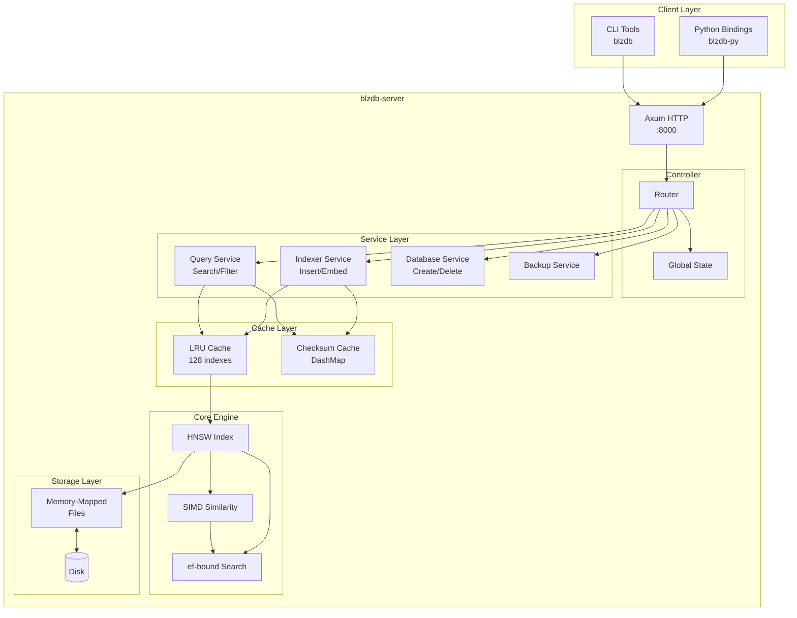
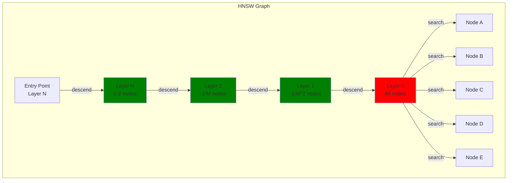
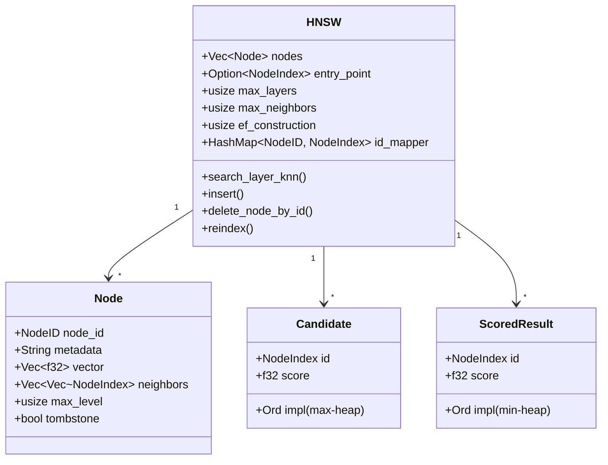
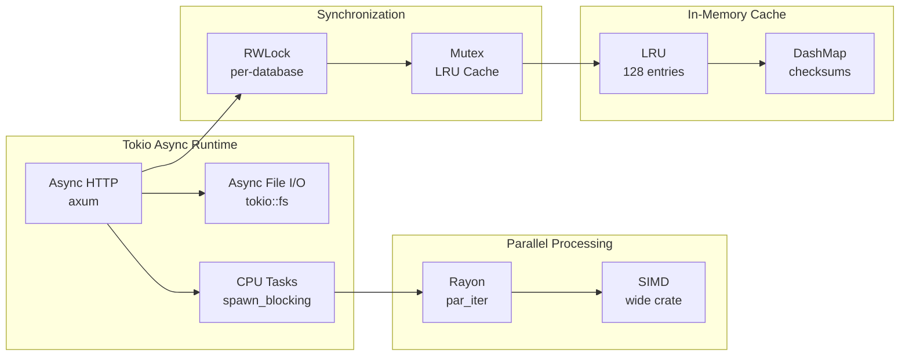
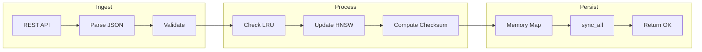

## Code Overview

> AI-generated documentation. May contain inaccuracies. Please verify with source code.

### Architecture

## HNSW Index

### Hierarchical Structure

### Insertion Flow

```mermaid
sequenceDiagram
    participant Client
    participant Axum
    participant Ctrl
    participant Indexer
    participant HNSW
    participant Disk
    Client ->> Axum: POST /embed
    Axum ->> Ctrl: route()
    Ctrl ->> Indexer: insert_vector()
    Indexer ->> HNSW: get_random_level()

    rect rgb(0, 0, 0)
    Note over HNSW, Disk: Layer Assignment
        HNSW ->> HNSW: exp(-ln(rand) / M)
    end

    Indexer ->> HNSW: search_layer_greedy(entry, layer)
    loop For each layer from top
        HNSW ->> HNSW: greedy descent
    end

    rect rgb(0, 0, 0)
        Note over HNSW, Disk: Neighbor Connection
        Indexer ->> HNSW: search_layer_knn(ef_construction)
        HNSW ->> HNSW: beam search
        HNSW -->> HNSW: bidirectional edges
        HNSW ->> HNSW: prune_connections()
    end

    HNSW ->> HNSW: assign node_id
    Indexer ->> Disk: persist to mmap
    Indexer -->> Ctrl: result
    Ctrl -->> Axum: response
    Axum -->> Client: JSON
```

### Search Flow

```mermaid
sequenceDiagram
    participant Client
    participant Axum
    participant Ctrl
    participant Query
    participant HNSW
    Client ->> Axum: GET /query
    Axum ->> Ctrl: route()
    Ctrl ->> Query: search()

    rect rgb(0, 0, 0)
        Note over Query, HNSW: Phase 1: Greedy Descent
        Query ->> HNSW: entry = top layer
        loop For each layer
            HNSW ->> HNSW: greedy search
        end
    end

    rect rgb(0, 0, 0)
        Note over Query, HNSW: Phase 2: Beam Search (Layer 0)
        Query ->> HNSW: search_layer_knn(ef_search)
        HNSW ->> HNSW: dual-heap search
    end

    rect rgb(0, 0, 0)
        Note over Query, HNSW: Phase 3: Adaptive Expansion
        opt If too many deleted
            HNSW ->> HNSW: expand ef by 1.5x
        end
    end

    HNSW -->> Query: top-k results
    Query -->> Ctrl: scored results
    Ctrl -->> Axum: response
    Axum -->> Client: JSON
```

### Node & Edge Structure

## Concurrency

## Data Flow

## Key Parameters

| Parameter           | Default | Description                  |
|---------------------|---------|------------------------------|
| `max_neighbors` (M) | 16      | Max edges per node per layer |
| `ef_construction`   | 200     | Search width during insert   |
| `ef_search`         | 50      | Search width during query    |
| `max_layers`        | 16      | Hierarchy depth              |
| `cache_size`        | 128     | LRU cache entries            |

## Complexity

| Operation | Complexity                 |
|-----------|----------------------------|
| Search    | O(log N × ef)              |
| Insert    | O(log N × ef_construction) |
| Delete    | O(1) mark + O(N) reindex   |
| Memory    | O(N × M × layers)          |

## Storage

- **Format**: Memory-mapped binary files
- **Persistence**: Atomic writes with sync
- **Recovery**: Checksum validation on load
- **Backup**: Snapshot to tarball
